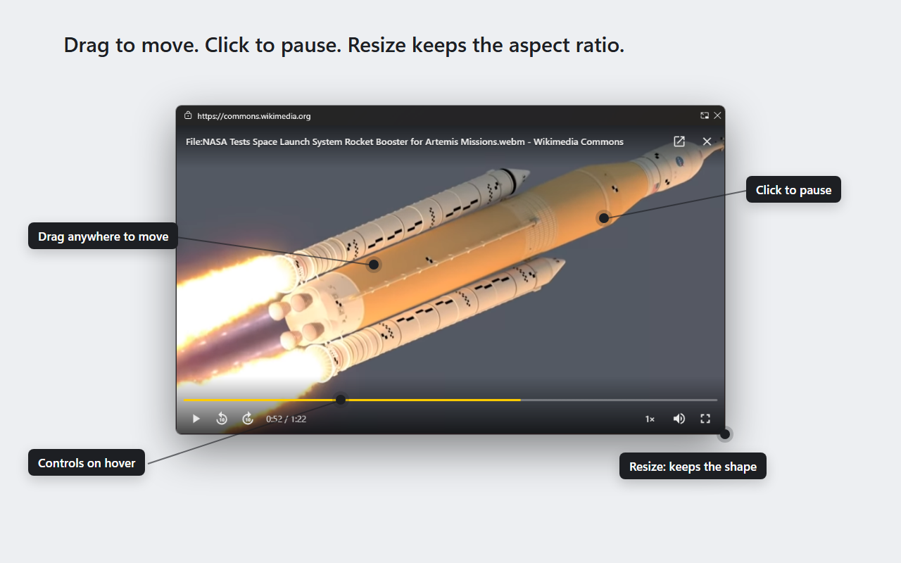

# Hoverframe

Hoverframe pops any web video into its own picture-in-picture (PiP) window that
you steer with the video itself.

The browser's own picture-in-picture moves only by a thin bar at the top,
ignores clicks on the picture, and lets the window stretch into any shape.
Hoverframe fixes all three.

## What it does

- **Drag from anywhere** — press any point of the video and move the window.
- **Click to play or pause** — a click without movement toggles playback.
- **Resize keeps proportions** — the window snaps to the video's shape while
  you drag an edge.
- **A clean window** — just the video under the browser's thin address bar;
  the controls appear on hover and fade away.
- **A button on every video** — hover a video and press the PiP button that
  appears on it. Or press `Alt+P` or the toolbar icon for the main video of
  the tab.
- **Hover controls** — seek bar with time, ±10 s skips, playback speed,
  volume, expand.
- **Captions come along** — subtitles the site draws over the video are
  mirrored into the window, and a **CC** button appears in the controls when
  the video has any.
- **Videos inside a frame** — a player the site frames from its own pages gets
  the same window and the same gestures.
- **Keyboard** — `Space`/`K` play or pause, `←`/`→` seek 5 s, `↑`/`↓` volume,
  `M` mute, `C` captions.
- **No tracking** — no network requests, no analytics; settings stay in your
  browser profile.

## Install

- **Chrome:** Chrome Web Store (link after publication)
- **Edge:** Edge Add-ons (link after publication)
- **From source:** download this repository, open `chrome://extensions` or
  `edge://extensions`, turn on Developer mode, press **Load unpacked** and
  pick the folder.

## How it works

The Document Picture-in-Picture API opens an always-on-top window, and the
extension moves the page's `<video>` into it. The API does not let a window
move itself (`moveTo` and `moveBy` are disabled) and resizes it only on a user
gesture. The extension's service worker does both through
`chrome.windows.update`: Chromium exposes the PiP window to extensions as an
ordinary window. That is what makes drag-from-anywhere and aspect-ratio
snapping possible.

Chromium caps the window's size: programmatic sizes stop at a quarter of the
screen area, manual resizing at 80% of each side. The expand button (`F`)
takes the window to the largest size the browser allows.

The API belongs to a page's top-level document, so a video inside an `<iframe>`
cannot open the window from there. The frame asks its parent instead, each
level passing the request up with the `<iframe>` it arrived through, until the
top document holds an element of its own. If that frame is same-origin its
`<video>` is reachable and is adopted like any other; adopting a video out of a
frame reloads it, so its position is restored afterwards. If the frame belongs
to another site the video cannot be reached at all, and the browser's own
picture-in-picture is what opens.

## Files

| File            | Role                                                      |
| --------------- | --------------------------------------------------------- |
| `content.js`    | Video detection, hover button, PiP window UI and logic    |
| `background.js` | Moves/resizes the PiP window via `chrome.windows`         |
| `content.css`   | Hover button styling                                      |
| `options.*`     | Settings page (toggles for every behaviour)               |

## Known limitations

- On some sites Hoverframe falls back to the browser's standard
  picture-in-picture, most often where the player is embedded from another site.
- The window cannot be made fullscreen. The expand button takes it to the
  largest size the browser allows.
- Resizing can misbehave on some videos. Known issue, not solved yet.
- Captions are not carried from every player.
- Video services with copy protection (Netflix and similar) may refuse to play
  or seek in the window.

## Privacy

Hoverframe collects nothing and makes no network requests. See the
[privacy policy](PRIVACY.md).

## License

MIT — see [LICENSE](LICENSE).
